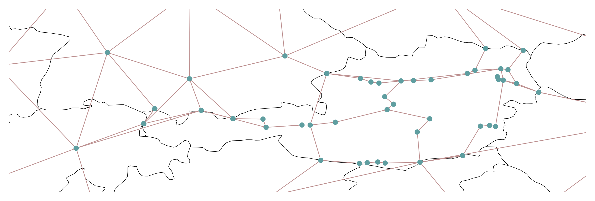

# Notes 22.04.2025

## Loading and Processing Geospatial Data

### Step 1: Load Austrian Lines and Border from Shapefiles
We started by loading the Austrian lines and border data from shapefiles using the `geopandas` library.

```python
lines_aut = gpd.read_file("qgis/lines_aut.shp")
grenze = gpd.read_file("qgis/Grenze.shp")
```

### Step 2: Set Coordinate Reference System (CRS)
We checked if the CRS was missing for the loaded shapefiles and set it to EPSG:31287 (Austria Lambert) if necessary.

```python
if lines_aut.crs is None:
    lines_aut.set_crs(epsg=31287, inplace=True)
if grenze.crs is None:
    grenze.set_crs(epsg=31287, inplace=True)
```

### Step 3: Reproject Data
We reprojected the data to ensure all datasets have the same CRS.

```python
lines_aut = lines_aut.to_crs(epsg=31287)
grenze = grenze.to_crs(epsg=31287)
```

## Loading and Processing Original Lines from CSV

### Step 4: Load CSV File
We loaded the original lines data from a CSV file.

```python
file_path = 'cross_border_lines_qgis_spatial.csv'
df = pd.read_csv(file_path)
```

### Step 5: Convert WKT Column to Shapely Geometries
We converted the WKT column in the CSV file to shapely geometries.

```python
df['geometry'] = df['wkt'].apply(wkt.loads)
```

### Step 6: Create a GeoDataFrame
We created a GeoDataFrame from the CSV data and set the CRS to EPSG:31287.

```python
gdf = gpd.GeoDataFrame(df, geometry='geometry')
gdf.set_crs(epsg=31287, inplace=True)
```

## Plotting the Data

### Step 7: Plot the Data
We plotted the Austrian lines, border, and original lines using `matplotlib`.

```python
fig, ax = plt.subplots(figsize=(12, 12))

grenze.plot(ax=ax, color="none", edgecolor="black", linewidth=1, label="Grenze.shp (Border)")
lines_aut.plot(ax=ax, color="purple", linewidth=2, label="lines_aut.shp (Austrian lines)")
gdf.plot(ax=ax, color="blue", linewidth=1, alpha=0.5, linestyle='--', label="Original CSV Lines")

plt.title("Comparison: Austrian Grid (lines_aut) vs Original 380kV Lines")
plt.xlabel("Easting")
plt.ylabel("Northing")
plt.grid(True)
plt.legend()
plt.tight_layout()
```

### Step 8: Save the Plot as a High-Resolution Image
We saved the plot as a high-resolution image.

```python
image_path = "highres_plot.png"
plt.savefig(image_path, dpi=300)
plt.close()
```

## Creating a PDF with the Plot

### Step 9: Create a PDF and Embed the High-Resolution Image
We created a PDF and embedded the high-resolution image into it using the `reportlab` library.

```python
pdf_path = "comparison_plot.pdf"
c = canvas.Canvas(pdf_path, pagesize=A4)
c.drawImage(image_path, 50, 400, width=500, height=500)
c.showPage()
c.save()
```

## Meeting 23.04.2025
--> Script, um Leitungen auf die fixen "Ö-Netzleitungen" zu legen.
Zb wie add transmission projects.

- Szenario hinterlegen:
    evtl reichen schon die eingebauten zukunftszenarien


## Summary
- Loaded and processed geospatial data from shapefiles and CSV.
- Set and reprojected CRS to ensure consistency.
- Plotted the data with appropriate styling to visualize comparisons.
- Saved the plot as a high-resolution image and embedded it into a PDF.


## Meeting 08.05.25
### Szenario
Residuallasten zb als csv. Mit mehr Knoten. Wieder auf pypsa-netzwerk aufteilen.Residual load

In the context of electricity systems and PyPSA, residual load refers to the net demand for electricity after accounting for renewable energy generation, like wind and solar. Essentially, it's the remaining load that needs to be met by other sources, such as conventional power plants. 

Zugriff datenbank? check

## Fortschritt 21.05.2025
snakemake ausführen mit --sdm conda
```bash
snakemake solve_elec_networks --configfile config/MA/config.128_wAT_entsoe_MA.yaml --sdm conda
```

## Meeting 22.05.2025
### Fragen:
- Szenarien? --> Ändern config file, zb:
    - cluster size
    - Transmission projects
    - Merge austria ...
    - add_extra_components
- Residuallasten. Beispiel CSV
    - Wo, wann laden? Überschreiben?
- einbauen in Workflow:
    - in der rule.smk configfile referenzieren und mit if-statements arbeiten. Lässt sich dan nauch mit wildcards verbinden?


Knoten: Übrig gebliebene mit nächstem Knoten verbinden.


Residuallasten Datenbank:
energiemengen und zeitprofile auf 1 normiert.
Dzt keine Residuallast csv.
Residuallasten verteilen auf die Knotenanzahl

CSV werte in gigawatt, tausende zeitschritte


Szenarion: unterschiedliche Residuallasten verwenden.

achtung ubereinstimmung node matpower und pypsa csv
alles ausßer powerstations anschauen

## 01.06.2025
### Vorgehensweise merge_austrian_network
Prozess funktioniert bis auf Knoten Reschenpass (IT) und Pradella (CH). Außerdem noch überprüfen Leupolz (D) und Fuessen (D).

#### Ablauf:
1. Pypsa-Eur Netz bis Clustering aus normalem Ablauf erzeugt (hier network1 genannt).
2. Danach über build_austrian_network_postgis EVT-Netzwerk über postgres geladen und daraus ein PyPSA Netzwerk (Österreich Detailliert) erzeugt. Namen werden auf substation_name gemappt, lines aus from_node & to_node zusammengebaut (hier networkAT genannt).
3. Entstandenes Netzwerk (networkAT) soll in merge_austrian_network mit großem PyPSA-Eur Netzwerk (network1) kombiniert werden. Dazu werden folgende Regeln befolgt:

    - Buses aus network1 werden mit networkAT abgeglichen und bei Abweichungen auf Koordinaten von networkAT verschoben. Das erfolgt 1:1 nach nächstem Nachbarn.
    - Nicht behandelte Grenzknoten (buses) aus networkAT werden gesucht, als neuer Knoten in network 1 eingefügt und mit den beiden nächsten Nachbarknoten verbunden. Dazu soll ein Nachbarknoten in Österreich liegen und einer außerhalb. Zu Verbindung werden neue Leitungen (lines) erzeugt.
    - Sollte bereits parallel eine line verlaufen, wird diese aufgeteilt und der Knoten dazwischen eingefügt.
    - PROBLEM: Knoten Reschenpass (IT) und Pradella (CH) werden bisher nicht nach IT bzw. CH verbunden

        - Das kann daran liegen, dass Reschenpass und Pradella nahe beieinander liegen und der algorithmus nicht berücksichtigt, dass diese Knoten nicht untereinander verbunden werden sollen.
        - --> Logik erweitern, um solchen Ausreißern vorzubeugen.
4. Am Schluss überprüfen, ob merge erfolgreich war. Am besten in eigener Regel.

#### Offene Punkte:
- Neue Regeln schön in PyPSA-eur einbetten, am besten ohne Ändern des *Snakefile* im Hauptordner.
- Parametrierung der Regeln, damit alles direkt im Configfile angepasst werden kannn.
- Möglichkeit für Szenarien
- Residuallasten: Fertige Residuallasten aus Datenbank auf AT Knoten verteilen

#### Optimierung:
- networkAT buses direkt mit "AT*" benennen, bzw. ISO2 codes für Länder
- 

#### Portabilität
- containerisierung des workflows über Snakemake und Docker:
```bash
 snakemake --containerize > Dockerfile
 # Dockerfile bearbeiten, erste 3 Zeilen rauslöschen
 # login bei git.unileoben.ac.at container registry
 docker login git.unileoben.ac.at:5050
 # image build, tag und upload
 docker build -t git.unileoben.ac.at:5050/evt1/pypsa-eur-evt . --push

```
- Ausführen von snakemake mit dem Image:
Image definieren im Snakefile (global) oder per rule
```bash
snakemake --sdm aptainer
```

### Update 10.06.2025
- merge_austrian_network fast fehlerfrei, es müssen noch redundante Leitungen entfernt werden.
- läuft, bis auf eine Leitung:


### Update 13.06.2025
- Residuallasten einfügen für Österreichische Knoten aus notebooks-MA/Residuallast:
    - Möglichkeit der Parametrierung für Szenarien (NIP2030 oder NIP2040)