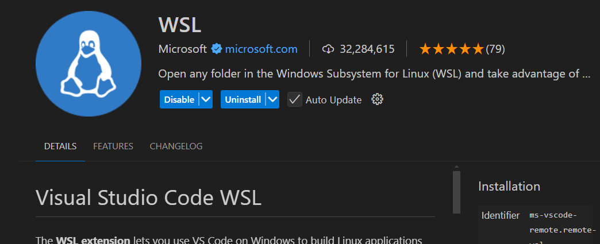
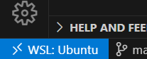
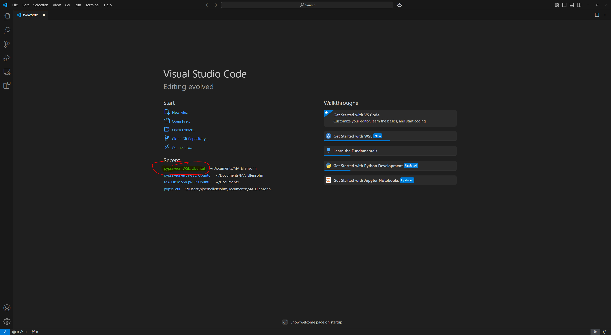
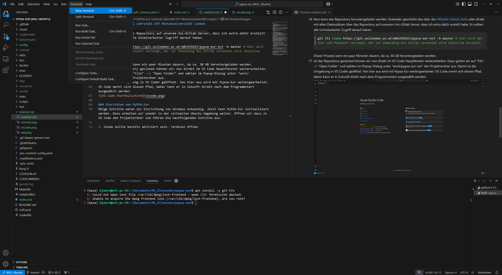
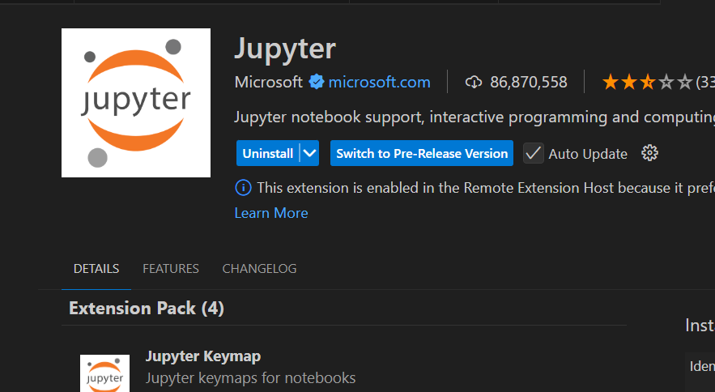

# 1. PyPSA-Eur Tutorial Lehrstuhl EVT Montanuniversität Leoben

Dies ist eine Anleitung zur schnellen Installation von PyPSA-Eur auf einem Windows Rechner am EVT.

Fragen und Verbesserungsvorschläge an:
Björn Ellensohn
bjoern.ellensohn@stud.unileoben.ac.at

- [1. PyPSA-Eur Tutorial Lehrstuhl EVT Montanuniversität Leoben](#1-pypsa-eur-tutorial-lehrstuhl-evt-montanuniversität-leoben)
  - [1.1. Voraussetzungen](#11-voraussetzungen)
  - [1.2. Vorbereitungen](#12-vorbereitungen)
  - [1.3. Einrichten von PyPSA-Eur](#13-einrichten-von-pypsa-eur)
  - [1.4. Ausführen Europa-Simulation](#14-ausführen-europa-simulation)
  - [1.5. Analyse und Auswertungen](#15-analyse-und-auswertungen)
    - [1.5.1. Jupyter Notebooks](#151-jupyter-notebooks)
    - [1.5.2. Beispiele](#152-beispiele)


## 1.1. Voraussetzungen
Als Voraussetzung wird benötigt:
- PC mit
  - Windows 10/11 und
  - mindestens 32GB Arbeitsspeicher (damit Europamodell mit 128 Knoten zuverlässig läuft. Eventuell auch mit weniger RAM realisierbar)
  - 60 GB freier Festplattenspeicher
  - Intel VT-d bzw. AMD-Vi oder IOMMU (Also die Hardware-Virtualisierungs-Fähigkeit) im BIOS aktiviert (bei den meisten Systemen schon aktiviert, sonst System Admin fragen)
- Admin-Zugriff (nur zur Installation von WSL2), danach kann mit normalem Benutzerkonto gearbeitet werden.

## 1.2. Vorbereitungen
Stand 19.01.2025 unterstützt PyPSA-Eur Windows Installationen nur über WSL2 (Windows Subsystem for Linux, Version 2).
WSL2 ist die offizielle Lösung von Microsoft, um eine minimale Linux-Laufzeitumgebung unter Windows herzustellen. Das wird über eine kleine virtuelle Maschine in Hyper-V realisiert. Der gesamte Vorgang ist hochautomatisiert und im Zusammenhang mit Visual Studio Code sehr einfach zu handhaben.

Folgende Schritte sind zur Vorbereitung notwendig:
1. In Windows mit einem Konto einloggen, das über Admin Berechtigungen verfügt.
2. Powershell als Administrator ausführen
3. Eingabe und Enter drücken
    ```powershell
    wsl --install
    ```
    Dadurch sollte WSL2 mit der Standard-Distribution Ubuntu Linux installiert werden.
4. Zur Sicherheit das System neu starten
5. Nun kann auf den normalen Benutzer gewechselt werden
6. Es sollte nun im Startmenü Ubuntu verfügbar sei, wenn nicht,
kann es aus dem Microsoft Store nachinstalliert werden.
7. Ubuntu ausführen. Jetzt wird nach einem neuen Benutzerkonto gefragt. Ausfüllen und merken.
8. Nun ist eine vollständige Ubuntu Linuxumgebung im Terminal verfügbar.
Theoretisch kann im Terminal gearbeitet werden, aufgrund der Übersichtlichkeit werden wir aber Visual Studio Code verwenden, um eine grafische Oberfläche zu haben.
9. Visual Studio Code aus dem Microsoft Store installieren, wenn noch nicht vorhanden.
10. In VS Code die WSL Erweiterung installieren.

11. Dadurch ist Links unten das blaue Menü für Remote-Verbindungen verfügbar:





12. Hier Connect to WSL auswählen, um sich mit der Standard-Distribution (in unserem Fall Ubuntu) zu verbinden.
VS Code installiert nun eine Server-Instanz in der Ubuntu Umgebung und gibt diese Im Hauptfenster aus. Man kann das ein bisschen mit Remote-Desktop vergleichen, mit dem Unterschied, dass hier nur eine Anwendung übertragen wird.
Nun kann wie gewohnt mit VS Code gearbeitet werden. Es ist jedoch wichtig zu beachten, dass alle Aktionen innerhalb der Virtuallen Ubuntu Maschine ausgeführt werden, das bedeutet:
- Das Dateisystem befindet sich innerhalb einer virtuallen Festplatte. Also kann nicht direkt auf lokale Dateien des Host-Betriebssystems (Windows) zugegriffen werden.
- Alle Befehle werden innerhalb der Linux Umgebug ausgeführt
- Die Programme und Installationen des Host-Systems existieren in der Linux Umgebung nicht.
13. VS Code ist jetzt mit der Ubuntu Umgebung verbunden.
Als nächsten Schritt werden wir eine Minimalinstallation von Conda einrichten, damit später für PyPSA-Eur die Abhängigkeiten installiert werden können.
Dazu folgende Befehle im Terminal von VS Code (oder Ubuntu Terminal aus dem Startmenü) ausführen:
    ```bash
    mkdir work && cd work # Zur Erstellung eines neuen Ordners
    wget https://github.com/conda-forge/miniforge/releases/download/24.11.2-1/Miniforge3-24.11.2-1-Linux-x86_64.sh # Lädt den Miniforge (Conda) Installer herunter
    chmod +x Miniforge3-24.11.2-1-Linux-x86_64.sh # Ausführbar machen
    ./Miniforge3-24.11.2-1-Linux-x86_64.sh # Installation starten
    ```
    Alle Fragen akzeptieren und auch die letzte Frage mit Ja (yes oder y) beantworten.
14. Damit ist Conda installiert, aber noch nicht im Terminal verfügbar. Dazu muss das Terminal neu instanziert werden, sprich Terminal schließen und wieder öffnen, danach wieder mit "cd" ins "work" Verzeichnis wechseln.
15. Nun kann entweder der master Branch heruntergeladen werden, um mit der aktuellsten Version zu arbeiten, oder es wird LFS (Large File Storage) genutzt, um schneller die benötigten Datensätze herunterzuladen. Hier spielt der Vorteil eine Rolle, dass das originale PyPSA-Eur Repository auf unserem MUL-Gitlab Server gespiegelt wurde.
Daher ist es je nach Bedarf eine gute Idee, auch git LFS (Git Large File Storage) nachzuinstallieren, da ich so die kompletten Daten meiner Versuche mit pypsa-eur zur verfügung stellen kann. Dazu existiert jetzt ein eigener branch "lfs-dataset".
    ```bash
    sudo apt update && sudo apt install -y git-lfs # Hier wird das sudo Passwort verlangt. Das ist das Benutzerpasswort.
    ```
16. Nun kann das Repository heruntergeladen werden. Entweder geschieht das über die [offizielle Github Seite](https://github.com/PyPSA/pypsa-eur), [über das Repository am MUL-Gitlab](https://git.unileoben.ac.at/evt1/pypsa-eur-evt) oder direkt mit allen Datensätzen über den lfs-dataset branch, der extra dafür erstellt wurde. Es sollten alle EVT-Mitarbeiter Zugriff darauf haben.
    ```bash
    git clone https://git.unileoben.ac.at/evt1/pypsa-eur-evt -b lfs-dataset # Hier wird der User und Passwort verlangt, der zur Anmeldung bei Gitlab verwendet wird (Muonline Account).
    ```
    Dieser Prozess kann ein paar Minuten dauern, da ca. 16 GB heruntergeladen werden.

    **Alternative:**
    Wenn nicht die vollen Daten benötigt werden, reicht es, nur den master Branch herunterzuladen. Dazu folgenden Befehl verwenden:
    ```bash
    git clone https://git.unileoben.ac.at/evt1/pypsa-eur-evt.git --single-branch -b master
    ```
17. Ist das Repository gecloned können wir nun direkt im VS Code Hauptfenster weiterarbeiten. Dazu gehen wir auf "File" --> "Open Folder" und wählen im Popup-Dialog unter "work/pypsa-eur-evt" den Projektordner aus.
Damit ist die Umgebung in VS Coder geöffnet. Von hier aus wird mit Pypsa-Eur weitergearbeitet.
VS Code merkt sich diesen Pfad, daher kann er in Zukunft direkt nach dem Programmstart ausgewählt werden:

18. NACHTRAG: Der Ubuntu Installation fehlt ein wichtiges Helferlein, das von PyPSA-Eur benötigt wird. Wir installieren "unzip" wie folgt nach:
    ```bash
    sudo apt install -y unzip
    ```

## 1.3. Einrichten von PyPSA-Eur
Obige Schritte waren zur Einrichtung von Windows notwendig. Jetzt kann PyPSA-Eur initialisiert werden. Dazu arbeiten wir wieder in der virtuellen Ubuntu Umgebung weiter. Öffnen wir dazu in VS Code den Projektordner und führen die nachfolgenden Schritte aus:

1. Conda sollte bereits aktiviert sein. Terminal öffnen:

2. (base) zeigt an, dass das Conda Environment "base" aktiv ist. Jetzt werden die Abhängigkeiten in ein neues Environment installiert. Das geschieht via
    ```bash
    mamba env create -f envs/environment.yaml -y # mamba ersetzt hier conda, da schneller
    ```
3. Nach Abschluss der Installation kann nun ins "pypsa-eur" Environment gewechselt werden:
    ```bash
    conda activate pypsa-eur
    ```
    (pypsa-eur) --> Immer überprüfen, ob man sich auch im richtigen Conda-Environment befindet.
4. Zur Überprüfung führen wir das Beispiel aus dem PyPSA-Eur Tutorial aus:
    ```bash
    snakemake solve_elec_networks --configfile config/test/config.electricity.yaml
    ```
5. Vor weiteren Aufrufen von Snakmake ist es empfehlenswert, die Überbleibsel der Zwischenschritte der Pipeline zu leeren. Das kann einigen Problemen vorbeugen.
   Befehl mit -Y quittieren. 
    ```bash
    snakemake purge
    ```
## 1.4. Europa-Simulation
Sollte bisher alles geklappt haben, kann nun auch meine Simulation aus der Projektarbeit gestartet werden. Hier sollte abhängig vom PC eine längere Zeitspanne eingeplant werden. Ich erwarte rund 3 Stunden Simulationszeit.

### 1.4.1 Gurobi Lizenz
PyPSA-Eur verwendet standardmäßig den Gurobi-Solver. Dies kann in der Konfigurationsdatei angepasst werden.
Bei größeren Simulationen wie der folgenden wird Gurobi in der Testlizenz abbrechen. Daher ist es notwendig, die Lizenzdatei im HOME-Verzeichnis von Ubuntu abzulegen.
WSL bietet dazu die Möglichkeit, eine automatisch angelegte Netzwerkfreigabe zu nutzen. Diese findet sich im normalen Windos Dateiexplorer links unter "Linux".
In diesem Ordner kann die gesamte Dateistruktur des Ubuntu Systems durchforstet werden. Uns interessiert aber nur der /home/<dein-User> Ordner.
Dort muss die gurobi.lic Datei abgelegt werden.

### 1.4.2 Ausführen

    ```bash
    snakemake solve_elec_networks --configfile config/my_configs/config.128_wAT_entsoe.yaml
    ```

Zur weiteren Information über Simulationsaufbau, wie PyPSA-Eur verwendet wird und woher die Konfigurationsparameter stammen, kann meine Projektarbeit durchgelesen werden: [Projektarbeit](projektarbeit-evt/projekt_energietechnik_pypsa.pdf)

## 1.5. Analyse und Auswertungen
Die Ergebnisse landen im Ordner results/*Experimentname*.
Am meisten interessiert uns hier das PyPSA-Netz mit der .nc Dateiendung unter results/*Experimentname*/networks/
Diese Datei wird im folgenden untersucht.

### 1.5.1. Jupyter Notebooks
Jupyter Notebooks ist ein übersichtliches Format, um in einer Python-Umgebung Daten zu analysieren. Ein Notebook unterstützt sowohl Python Code als auch formatierten Text in Markdown, was stark zur Übersichtlichkeit beitragen kann. Code und Text werden in einzelnen Zellen formatiert und ausgeführt.

Dankenswerter Weise unterstützt VS Code Jupyter Notebooks direkt, dazu muss die Jupyter Extension installiert werden.



### 1.5.2. Beispiele
Unter dem [Notebooks](notebooks-evt/) Verzeichnis sind Jupyter Notebooks zu finden, die Beispiele zu Analyse und Plotting beinhalten.